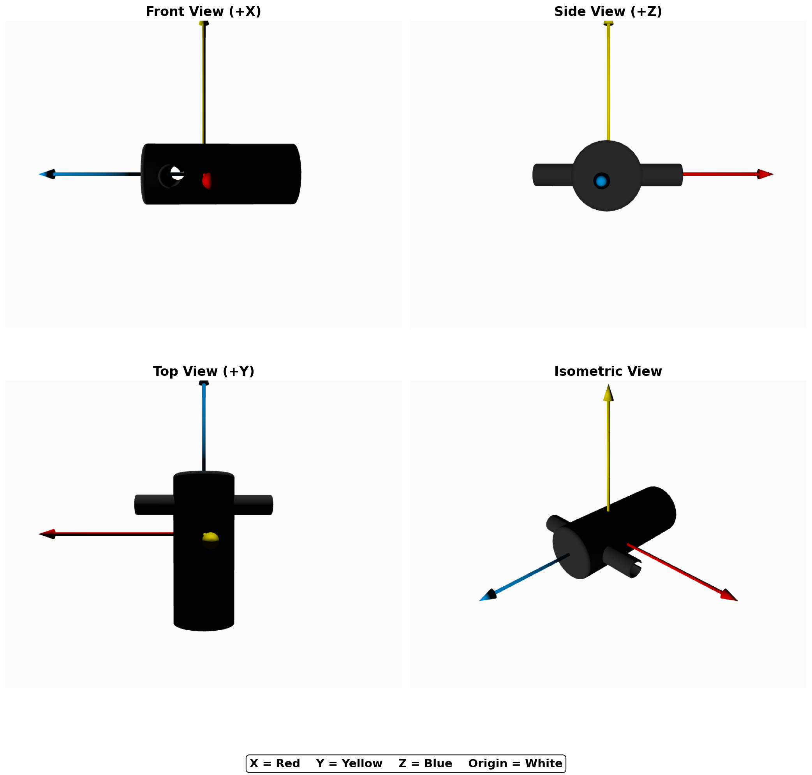

# FoundationPose VCB

NVIDIA [FoundationPose](https://nvlabs.github.io/FoundationPose/) (CVPR 2024 Highlight)의 포크로, Texture-less한 고반사 단색 금속이라는 성질이 있는 VCB(산업용 핸들) pose 추정에 특화된 확장 버전입니다. Jetson AGX Orin에서 RealSense 카메라와 ROS를 활용한 실시간 6DoF pose 추정 및 트래킹을 지원합니다.

**원본 논문:** [FoundationPose: Unified 6D Pose Estimation and Tracking of Novel Objects](https://arxiv.org/abs/2312.08344)

**주요 확장 기능:**
- Mask R-CNN 기반 세그멘테이션 (Jetson 환경)
- Mask IoU 스코어링 (산업 현장 클러터 환경 대응)
- ROS 통합 (`PoseStamped` 발행, TF 브로드캐스트)
- RGB 전용 모드 (금속/반사 표면 대응)
- Z축 보정 (벽면 장착 물체 대응)

---

## VCB 모델 규격

Pose 추정 대상인 VCB 핸들의 메시 좌표계입니다.



### 크기 (단위: cm, FoundationPose에서는 `--mesh_scale 0.01` 사용)

| 축 | 크기 | 설명 |
|---|---|---|
| X | 4.01 | 핸들 방향 |
| Y | 1.80 | 두께 |
| Z | 4.40 | 몸체 길이 |

### 모델 좌표계 (메시 기준)

| 방향 | 설명 |
|---|---|
| +X | 핸들 오른쪽 |
| -X | 핸들 왼쪽 |
| +Y | 위 |
| -Y | 아래 |
| +Z | 몸체 앞면 |
| -Z | 몸체 뒷면 |

- 원점: 메시 중심 (0, 0, 0)
- Vertices: 1001 / Faces: 1420
- 경로: `vcb/ref_views/ob_000001/model/`

### 좌표계

모든 출력(시각화, Euler, 저장 파일, ROS)이 `ob_in_cam` 행렬을 **그대로** 사용합니다.

**카메라 좌표계 (OpenCV 규칙)**
```
       +Z (깊이, 카메라가 바라보는 방향)
      /
     /
    O ----→ +X (오른쪽)
    |
    ↓
   +Y (아래)
```

`ob_in_cam` 4x4 행렬 = 모델 원점·축이 카메라 좌표계에서 어디에 있는지를 나타냄.

#### 시각화 (track_vis)

축 색상이 모델 좌표계와 일치합니다.

| 색상 | 방향 |
|---|---|
| 빨강 (R) | +X (핸들 오른쪽) |
| 초록 (G) | +Y (위) |
| 파랑 (B) | +Z (몸체 앞면) |

#### Euler 출력 (JSON / 저장)

`ob_in_cam` 회전 행렬에서 Euler 각도를 직접 추출합니다 (부호 변환 없음).

각도는 [-90°, 90°] 범위로 정규화됩니다.

#### 요약

| 출력 | X / roll | Y / pitch | Z / yaw |
|---|---|---|---|
| 모델 좌표계 (원본) | +X | +Y | +Z |
| ROS PoseStamped | 그대로 | 그대로 | 그대로 |
| track_vis 시각화 | 그대로 | 그대로 | 그대로 |
| Euler (JSON/저장) | 그대로 | 그대로 | 그대로 |
| 저장 파일 (ob_in_cam/) | 그대로 | 그대로 | 그대로 |

---

## 사전 준비

### 1. 저장소 클론

```bash
git clone https://github.com/KwanjoonPark/FoundationPose_VCB.git
cd FoundationPose_VCB
git checkout jetson
```

### 2. 모델 가중치 다운로드

Google Drive ([Refiner/Scorer](https://drive.google.com/drive/folders/1DFezOAD0oD1BblsXVxqDsl8fj0qzB82i?usp=sharing), [R-CNN Mask](https://drive.google.com/drive/folders/1FEajd4v0Y7THdY5KOvsY_cdBPCKg70Ng?usp=drive_link)) 에서 네트워크 가중치를 다운로드하여 `weights/` 폴더에 배치합니다.

- Refiner: `weights/2023-10-28-18-33-37/`
- Scorer: `weights/2024-01-11-20-02-45/`
- R-CNN Mask: `weights/2026-02-12-13-41-52/`

### 3. Test Dataset 다운로드 (선택)

Google Drive ([test_scene](https://drive.google.com/drive/folders/1FEajd4v0Y7THdY5KOvsY_cdBPCKg70Ng?usp=drive_link)) 에서 테스트 데이터셋을 다운로드 하여 `vcb/ref_views/` 폴더에 배치합니다.

```
test_scene/
├── depth/
│   ├── 000000.png
│   └── 000001.png
├── rgb/
│   ├── 000000.png
│   └── 000001.png
└── cam_K.txt
```

### 4. Docker 컨테이너 실행

**Prerequisites:**
- Jetson AGX Orin with JetPack 5.1 (L4T R35.2.1)
- Docker with NVIDIA runtime (`nvidia-container-runtime`)
- 최소 25GB 여유 디스크 (빌드 시), 최종 이미지 ~15GB
- 베이스 이미지는 첫 빌드 시 자동으로 pull됨: `nvcr.io/nvidia/l4t-pytorch:r35.2.1-pth2.0-py3` (~11.7GB)

```bash
# 이미지 빌드 (최초 1회, ~2-3.5시간)
docker build -f docker/dockerfile.jetson -t foundationpose-jetson docker/

# 컨테이너 실행
bash docker/run_container_jetson.sh

# C++/CUDA 익스텐션 빌드 (컨테이너 안에서 최초 1회)
bash docker/build_extensions_jetson.sh
```

재접속 시:
```bash
docker exec -it foundationpose-jetson bash
cd /home/robot/Workspace/Docker_Test/FoundationPose_VCB
```

### 5. RealSense 카메라 실행 (호스트에서)

카메라는 컨테이너가 아닌 **호스트**에서 실행합니다. 컨테이너는 `--network=host`로 ROS 토픽에 접근합니다.

```bash
roslaunch realsense2_camera rs_camera.launch  align_depth:=true  pointcloud:=false  enable_gyro:=false  enable_accel:=false  color_width:=1280  color_height:=720  color_fps:=30
```

---

## Test Dataset 으로 6D 추정

### run_est.py — 오프라인 Pose 추정

저장된 이미지 시퀀스에 대해 pose 추정 수행:
```bash
python run_est.py --debug 2
```
- debug 1 : 6 DoF 정보를 담고 있는 4x4행렬 (ob_in_cam, cam_in_ob)


- debug 2 : Object 위에 6 DoF 정보 시각화 (track_vis)


- debug 3 : Pose Estimation 과정 시각화 (vis_refiner, vis_scorer)


---

## Camera로 실시간 6D 추정

### pose_estimator.py — 인터랙티브 Pose 추정

카메라 피드를 보면서 수동으로 pose 추정을 트리거합니다.

```bash
python camera/pose_estimator.py
```


**키 조작:**
| 키 | 기능 |
|---|---|
| `p` / `Space Bar` | Pose 추정 (단일) |
| `t` | 트래킹 모드 ON/OFF (연속 추정) |
| `r` | 리셋 (트래킹 초기화) |
| `s` | 현재 프레임 + 결과 저장 |
| `q` | 종료 |

**주요 옵션 (default):**
```bash
python camera/pose_estimator.py \
    --mesh_file vcb/ref_views/ob_000001/model/model.obj \
    --mask_model weights/2026-02-12-13-41-52/model_best.pth \
    --mask_type maskrcnn \
    --mask_conf 0.9 \
    --input_mode rgb \
    --symmetry z180 \
    --use_light True
```

### pose_streamer.py — 연속 자동 스트리머

키 입력 없이 매 프레임 자동으로 pose를 추정하여 ROS 토픽에 발행합니다. (프레임 당 Pose 추정 시간 약 8초 / Object가 감지되지 않을 때 바로 에러 출력)

```bash
# GUI 모드
python camera/pose_streamer.py

# Headless 모드 (GUI 없이 ROS만 발행, 배포용)
python camera/pose_streamer.py --headless
```

**키 조작 (GUI 모드):**
| 키 | 기능 |
|---|---|
| `q` | 종료 |

### pose_debugger.py — 디버그 시각화

FoundationPose 내부 시각화(scorer/refiner 후보 렌더링)를 별도 창으로 보여주고 파일로 저장합니다.

```bash
python camera/pose_debugger.py
```

ROS publisher 없이 디버깅 전용. `camera/debug/{session}/` 에 프레임별 결과 저장.

키 조작은 pose_estimator.py와 동일합니다.

## ROS 토픽

pose_estimator, pose_streamer가 발행하는 토픽:

| 토픽 | 타입 | 내용 |
|---|---|---|
| `/foundation_pose/pose` | `PoseStamped` | 6DoF pose (position + quaternion) |
| `/foundation_pose/result` | `String` (JSON) | pose, euler 각도, confidence 포함 |

PoseStamped 예시:


JSON 예시:


---

## 옵션 설명

### 메시 파일 (`--mesh_file`)

| 파일 | 설명 |
|---|---|
| `model.obj` | 원본 메시 (텍스처 매핑) |
| `model_vc.ply` | Vertex color 메시 |
| `model_vc_final.ply` | 최종 vertex color 메시 |

경로: `vcb/ref_views/ob_000001/model/`

### 입력 모드 (`--input_mode`)

| 모드 | 설명 |
|---|---|
| `rgb` | RGB만 사용 (기본값). 금속/반사 표면에 적합 |
| `rgbd` | RGB + Depth. 텍스처가 있는 물체에 유리 |

### 대칭 (`--symmetry`)

VCB 핸들은 원통형이므로 `z180` 사용 (Z축 기준 180도 대칭).

### Shading (`--use_light`)

| 값 | 설명 |
|---|---|
| `True` | Phong shading (광원 효과 적용) |
| `False` | Constant shading (vertex color 그대로) |

### Z축 보정 (`--fix_z_axis`)

벽면 장착 물체용. 물체 Z축이 항상 카메라를 향하도록 보정합니다.
- 가설 단계: 뒷면 후보 ~50% 제거 (`front_hemisphere_only`)
- 추정 후: Z축 방향 재확인 + 필요 시 FLIP_X 적용

---

## 기타 기능

### mask_generator.py — 마스크 시각화

Mask R-CNN 또는 YOLO 세그멘테이션 결과를 시각화하고 저장합니다. Pose 추정 없이 마스크 품질만 확인할 때 유용합니다.

```bash
# 단일 이미지
python mask_generator.py \
    --model weights/2026-02-12-13-41-52/model_best.pth \
    --model_type maskrcnn \
    --image vcb/ref_views/test_scene/rgb/000000.png \
    --conf 0.9

# 이미지 디렉토리 일괄 처리
python mask_generator.py \
    --model weights/2026-02-12-13-41-52/model_best.pth \
    --model_type maskrcnn \
    --image_dir vcb/ref_views/test_scene/rgb/ \
    --conf 0.9
```

결과는 `debug/masks/`에 저장됩니다. 마스크 영역은 빨간색 오버레이, 윤곽선은 노란색으로 표시됩니다.

| 옵션 | 기본값 | 설명 |
|---|---|---|
| `--model` | (필수) | 모델 가중치 경로 |
| `--model_type` | maskrcnn | 모델 타입 (maskrcnn/yolo) |
| `--image` | None | 단일 이미지 경로 |
| `--image_dir` | None | 이미지 디렉토리 경로 |
| `--output_dir` | debug/masks | 결과 저장 경로 |
| `--conf` | 0.9 | Confidence threshold |

---

## Troubleshooting

- GPU 4090 등 최신 GPU 설정: [Issue #27](https://github.com/NVlabs/FoundationPose/issues/27)
- Windows 환경 설정: [Issue #148](https://github.com/NVlabs/FoundationPose/issues/148)
- 비정상적인 결과가 나올 경우: [Issue #44](https://github.com/NVlabs/FoundationPose/issues/44#issuecomment-2048141043), [설정 가이드](https://github.com/030422Lee/FoundationPose_manual)

---

## 인용 (Citation)

```bibtex
@InProceedings{foundationposewen2024,
author        = {Bowen Wen, Wei Yang, Jan Kautz, Stan Birchfield},
title         = {{FoundationPose}: Unified 6D Pose Estimation and Tracking of Novel Objects},
booktitle     = {CVPR},
year          = {2024},
}
```

---

## 라이선스

코드와 데이터는 [NVIDIA Source Code License](LICENSE) 하에 배포됩니다. Copyright © 2024, NVIDIA Corporation. All rights reserved.

## 연락처

원본 FoundationPose 관련 문의: [Bowen Wen](https://wenbowen123.github.io/)
